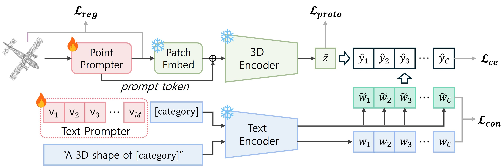
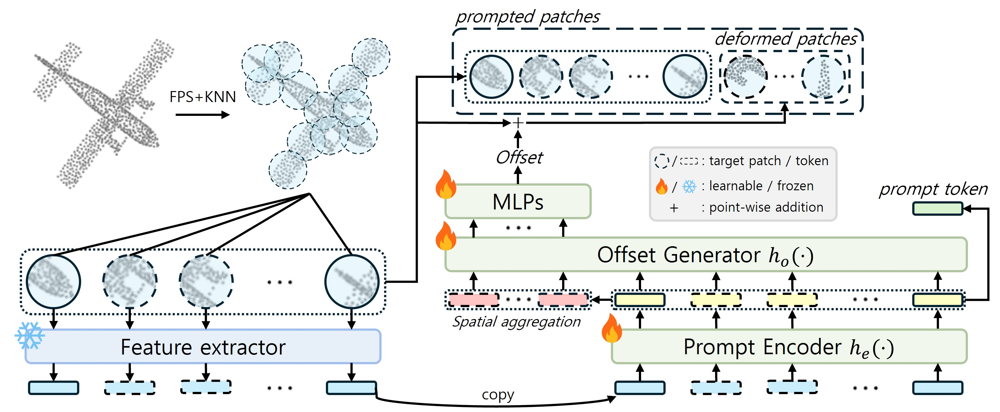

# P<sup>3</sup>T: Prototypical Point-level Prompt Tuning with Enhanced Generalization for 3D Vision-Language Models
<p align="center">

</p>

This repository provides the official implementation of  
"P<sup>3</sup>T: Prototypical Point-level Prompt Tuning with Enhanced Generalization for 3D Vision-Language Models"
> [Geunyoung Jung](https://gyjung975.github.io/), Soohong Kim, Kyungwoo Song, and Jiyoung Jung  
> ICRA 2026

## Abstract
<p align="center">

</p>

> With the rise of pre-trained models in the 3D point cloud domain for a wide range of real-world applications, adapting them to downstream tasks has become increasingly important. However, conventional full fine-tuning methods are computationally expensive and storage-intensive. Although prompt tuning has emerged as an efficient alternative, it often suffers from overfitting, thereby compromising generalization capability. To address this issue, we propose Prototypical Point-level Prompt Tuning (P$^3$T), a parameter-efficient prompt tuning method designed for pre-trained 3D vision-language models (VLMs). P$^3$T consists of two components: 1) \textit{Point Prompter}, which generates instance-aware point-level prompts for the input point cloud, and 2) \textit{Text Prompter}, which employs learnable prompts into the input text instead of hand-crafted ones. Since both prompters operate directly on input data, P$^3$T enables task-specific adaptation of 3D VLMs without sacrificing generalizability. Furthermore, to enhance embedding space alignment, which is key to fine-tuning 3D VLMs, we introduce a prototypical loss that reduces intra-category variance. Extensive experiments demonstrate that our method matches or outperforms full fine-tuning in classification and few-shot learning, and further exhibits robust generalization under data shift in the cross-dataset setting.

## Setup
```shell
git clone https://github.com/gyjung975/P3T.git
cd P3T

conda create -n p3t python=3.8.16
conda activate p3t

conda install pytorch==1.12.1 torchvision==0.13.1 torchaudio==0.12.1 cudatoolkit=11.3 -c pytorch
pip install wandb h5py easydict open3d ftfy regex timm termcolor

pip install 'git+https://github.com/katsura-jp/pytorch-cosine-annealing-with-warmup'
pip install "git+https://github.com/erikwijmans/Pointnet2_PyTorch.git#egg=pointnet2_ops&subdirectory=pointnet2_ops_lib"
pip install --upgrade https://github.com/unlimblue/KNN_CUDA/releases/download/0.2/KNN_CUDA-0.2-py3-none-any.whl
```
## Dataset
* Download datasets under `data/`
```shell
data
 |── modelnet40_normal_resampled
 |── ScanObjectNN
 |── objaverse-lvis
```

## Pre-trained Models
* Download pre-trained models under `data/pretrained_models/` from [ULIP](https://github.com/salesforce/ULIP).
```shell
data
 |── pretrained_models
```

## Prototype Generation
* First, prepare prototypes for each dataset under `data/prototype/`.
```shell
python prototype_gen.py --ulip2 --evaluate_3d --test_ckpt_addr data/pretrained_models/pointbert_ulip2.pt --model ULIP_PointBERT_RAW --dataset_name modelnet40 --npoints 1024 --batch_size 256
```

## Train
```shell
bash scripts/cls/mn40.sh 0
bash scripts/cls/lvis.sh 2
```

<!--
## Citation
```bibtex
@inproceedings{p3t,
  title={P3T: Prototypical Point-level Prompt Tuning with Enhanced Generalization for 3D Vision-Language Models,
  author={Geunyoung Jung, Soohong Kim, Kyungwoo Song, Jiyoung Jung},
  booktitle={IEEE International Conference on Robotics and Automation (ICRA)},
  year={2026}
}
```
-->

## Acknowledgements
Our codes are built upon [CoOp](https://github.com/KaiyangZhou/CoOp/), [ULIP](https://github.com/salesforce/ULIP), and [PPT](https://github.com/auniquesun/PPT). Thanks for their efforts.

<!--
## Contact
If you have any question about our work, please create new or search related issues in this repository. 
-->